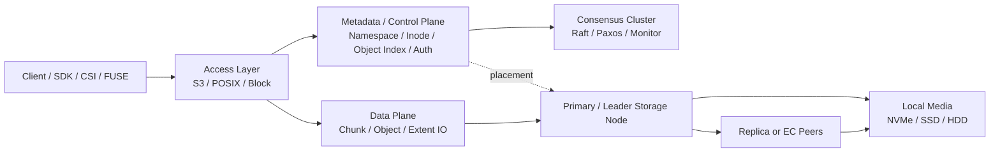
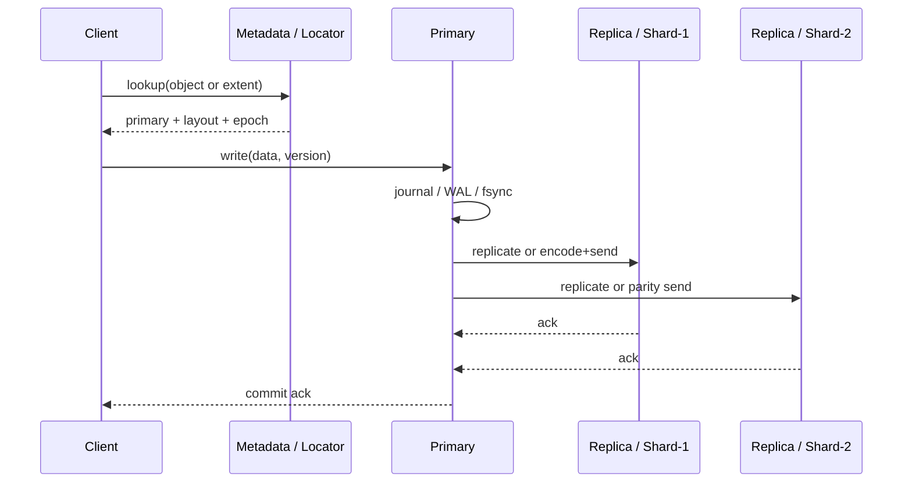

# 硬核分布式存储面试手册

> 目标：这不是“八股速成版”，而是一份拿去面试、系统设计、线上排障都能用的高密度提纲。  
> 适用范围：对象存储、块存储、分布式文件系统，以及它们在云原生和 AI 场景里的演化。  
> 阅读建议：先背 `1. 一句话打穿`、`6. 边界`、`9. 实战题`，再看细节。

## 1. 一句话打穿

分布式存储的本质，不是“把很多盘拼起来”，而是：

1. 把数据切成可管理的单元。
2. 把这些单元稳定地放到故障域里。
3. 在节点、磁盘、机架、可用区不断出问题的情况下，仍然保证可接受的一致性、可用性、性能和成本。

一句更面试化的话：

> 分布式存储 = 数据切分 + 元数据管理 + 副本/纠删码冗余 + 一致性协议 + 故障恢复 + 流量调度 + 成本控制。

如果面试官只给你 30 秒，答这句：

> 我理解分布式存储的核心矛盾是，单机介质的时延和吞吐有物理上限，但业务要求容量、可用性和弹性无限扩展，所以系统必须在网络上重建“像本地盘一样可用”的抽象，而代价就是元数据复杂度、尾时延、恢复流量和一致性成本。

## 2. 存储类型总览

| 类型 | 抽象 | 典型接口 | 优点 | 缺点 | 适合场景 |
| --- | --- | --- | --- | --- | --- |
| 块存储 | 逻辑卷 / block device | iSCSI, RBD, EBS, CSI Raw Block | 延迟低，适合数据库和虚拟机 | 元数据能力弱，不适合海量对象检索 | 数据库、VM、日志盘 |
| 文件存储 | 文件 / 目录 / inode | NFS, SMB, CephFS, Lustre | POSIX 语义友好 | 元数据热点重，扩展最难 | 共享文件、训练集、家目录 |
| 对象存储 | bucket / object / metadata | S3, Swift, RGW, MinIO | 易扩展、成本低、天然多租户 | 不适合低延迟随机覆盖写，POSIX 不完整 | 图片、备份、数据湖、归档 |

面试里一定要补一句：

> 很多系统不是纯粹的一种存储，而是底层统一对象层，上层再暴露块、文件、对象三种协议。Ceph 就是典型例子。

## 3. 核心架构图

这张图表达 4 件事：

1. 元数据和数据平面通常分离。
2. 元数据一般更偏 CP，数据平面更偏吞吐和恢复效率。
3. 真正限制扩展性的，不只是盘，更多时候是元数据、网络和恢复风暴。
4. 高性能存储几乎都会把“控制路径”和“数据路径”拆开。

## 4. 底层原理

### 4.1 数据切分与寻址

存储系统不会直接拿“一个文件”或者“一个卷”去做复制，而是先拆成更小单元：

1. 块存储常见单元是 page、extent、object。
2. 文件存储常见单元是 inode + data block + directory entry。
3. 对象存储常见单元是 object + object metadata + multipart chunk。

这么做的原因：

1. 便于并行写入和恢复。
2. 便于跨节点放置。
3. 便于局部校验和局部修复。
4. 便于快照、克隆、去重、冷热分层。

面试关键词：

- `chunk size`
- `stripe width`
- `extent map`
- `placement group`
- `shard`
- `multipart upload`

### 4.2 元数据为什么是存储系统的命门

元数据记录的是“数据在哪里、归谁、版本是多少、权限是什么、当前谁能写”。

如果没有元数据，数据块再多也只是散落的比特。

元数据通常承担这些职责：

1. 命名空间：目录树、bucket、对象名、卷名。
2. 定位：某个对象或 extent 位于哪些节点。
3. 版本与并发控制：epoch、generation、lease、fencing。
4. 权限与租户隔离。
5. 垃圾回收、快照引用计数、生命周期管理。

为什么说文件存储最难：

1. POSIX 目录、rename、link、权限继承都压在元数据上。
2. 小文件场景中，元数据 IO 很容易比数据 IO 更贵。
3. 热目录和单目录海量文件会直接把 MDS 或目录索引打穿。

### 4.3 数据放置策略

数据切出来以后，要决定“放哪”。这一步本质是在做故障域映射。

常见策略：

1. `consistent hashing`：简单、去中心化，但对复杂故障域表达一般。
2. `CRUSH`：可描述 host、rack、room、AZ 等层级，适合大规模去中心化放置。
3. 中心化 placement service：控制更强，但中心服务容易成为瓶颈。

面试加分点：

> 放置策略不是单纯负载均衡，而是“在容量、故障域、恢复成本、网络拓扑、热点概率”之间找平衡。

### 4.4 冗余方式：副本 vs 纠删码

#### 三副本

优点：

1. 读路径简单。
2. 恢复逻辑简单。
3. 小 IO 和覆盖写友好。
4. 尾时延通常更稳定。

缺点：

1. 成本高，原始容量利用率通常只有 33% 左右。
2. 跨 AZ 或跨机架时网络成本高。

#### 纠删码 EC

典型 `k+m`，比如 `8+3`、`4+2`。

优点：

1. 容量利用率高。
2. 冷数据和大对象很划算。

缺点：

1. 小写入容易触发读改写。
2. 编码解码吃 CPU。
3. 恢复路径复杂，尾时延容易变差。
4. 热数据场景不一定划算。

面试结论不要答死：

> 热数据、频繁小写、低延迟要求高，优先副本。冷数据、顺序读多、容量敏感，优先 EC。很多生产系统最终是混合策略：热层副本，温冷层 EC。

### 4.5 写路径

写路径的几个关键点：

1. 客户端先找定位信息，未必每次都查元数据，可能本地缓存。
2. 真正接收客户端写的通常是 primary 或 leader。
3. primary 先写 journal/WAL，再复制或编码。
4. 返回成功，取决于 `ack policy`，比如本地落盘成功、主从都落盘成功、或者 quorum 成功。

写延迟的近似式：

`L_write ≈ 路由 + primary排队 + journal/fsync + 副本/EC传输 + 最慢ack + 返回`

这意味着：

1. 同步复制一定比本地盘慢。
2. 跨机架、跨 AZ 会放大网络 RTT。
3. 尾延迟取决于最慢副本，不取决于平均副本。

### 4.6 读路径

读路径看似简单，实际也分很多种：

1. 本地命中：客户端缓存、页缓存、对象网关缓存。
2. 主副本读取：简单但可能形成热点。
3. 任一副本读取：吞吐更高，但要处理陈旧读风险。
4. EC 读取：理想情况下读 `k` 个数据块，退化时可能要做重构。

读延迟近似式：

`L_read ≈ 路由 + 元数据定位 + 队列等待 + 介质访问 + 网络返回`

如果是小随机读，瓶颈往往不在带宽，而在：

1. 元数据查找。
2. CPU 上下文切换。
3. 队列堆积。
4. SSD/HDD 随机访问时延。

### 4.7 一致性模型

不要把“一致性”只理解成数据库事务。存储里至少有 4 个层面：

1. 元数据一致性：目录、对象列表、inode 映射是否一致。
2. 数据一致性：写完后再读，能否立刻读到最新。
3. 副本一致性：各副本版本号、日志、校验和是否一致。
4. 故障切换一致性：主从切换时会不会出现双主写。

常见语义：

1. 强一致：写成功后，后续读必须看到最新值。
2. 读己之写：会话内自己一定能看到自己的写。
3. close-to-open：文件关闭后，下次打开能看到更新。
4. 最终一致：短时间内可能读到旧值，但最终收敛。

面试非常容易被追问：

> 为什么对象存储历史上很多是最终一致，现在越来越强调强一致？

标准答法：

1. 数据湖、日志分析、AI pipeline 越来越依赖“写完立刻可读”。
2. 最终一致会把复杂性推给上层业务。
3. 现代对象存储已经越来越能承受强一致控制面的成本。

### 4.8 故障检测、恢复、重平衡、校验

一个成熟系统至少要有以下机制：

1. 心跳与故障检测：节点、磁盘、网络分区、时钟漂移。
2. 自动故障转移：leader 切换、lease 失效、fencing。
3. 恢复：复制缺失副本，或者重构 EC shard。
4. 重平衡：扩容后把旧热点和倾斜迁走。
5. Scrub / checksum：发现静默数据损坏。
6. Backfill / resync：新盘、新节点、掉线恢复后的数据补齐。

一句硬核口径：

> 存储集群真正难的不是 steady state，而是 non-steady state，也就是节点失效、网络抖动、扩容、降级恢复这些阶段。很多系统平时很快，一进入恢复态就崩。

## 5. 技术特性

一个成熟分布式存储系统通常追求这些特性：

1. 横向扩展：容量和吞吐尽量随节点数增长。
2. 故障域隔离：盘坏、机坏、机架坏、AZ 坏都要有设计。
3. 多租户：配额、限流、隔离、审计。
4. 多协议接入：对象、文件、块最好能统一底层。
5. 数据保护：副本、EC、快照、克隆、版本、WORM、生命周期。
6. 可观测性：容量、吞吐、IOPS、延迟分位、恢复速度、校验失败率。
7. 运维自动化：扩容、缩容、替盘、滚动升级、自动重平衡。
8. 安全：加密、KMS、证书、最小权限。

## 6. 上下限边界、性能边界、容量边界

这部分是最容易拉开水平差距的地方。面试别只说“看业务场景”，要把边界说具体。

### 6.1 下限边界：最小可用集群不是 1 台机器

#### 副本系统的下限

1. 真正要自动故障切换，至少需要 3 个故障单元，或者 2 节点 + 1 witness。
2. 只有 2 个节点时，如果网络分区，你很难在不引入 witness 的前提下安全决定谁能继续写。

#### EC 系统的下限

1. 至少要有 `k+m` 个可用 shard 位置。
2. 如果还要求跨 host / rack / AZ 放置，最小节点数会更高。

一句话记忆：

> 能存，不代表能高可用；能高可用，不代表能安全 failover。

### 6.2 容量上限与有效容量

先背几个公式：

#### 副本

`usable_capacity ≈ raw_capacity / replica_count`

三副本大致是：

`usable ≈ raw * 33%`

#### EC

`usable_capacity ≈ raw_capacity * k / (k + m)`

例子：

1. `8+2`，理论利用率约 80%。
2. `4+2`，理论利用率约 66.7%。
3. `8+3`，理论利用率约 72.7%。

但生产里不能只看理论值，还要扣掉：

1. 预留恢复空间。
2. 热点不均匀造成的碎片和倾斜。
3. 元数据空间。
4. 压缩、快照、垃圾回收滞后。

真实世界更像：

`effective_usable < theoretical_usable`

### 6.3 时延下限：永远快不过物理

写入下限由这些因素共同决定：

1. 网络 RTT。
2. journal/fsync。
3. 最慢副本确认。
4. 编码校验开销。
5. 队列等待。

所以：

1. 同步三副本写，绝不会接近本地内存时延。
2. 跨 AZ 同步写，时延通常会被 RTT 明显拉高。
3. HDD 系统对随机写非常敏感。

面试回答模板：

> 分布式存储写延迟的理论下限受网络和 durable commit 约束，真正瓶颈常常不是代码，而是 fsync、最慢副本和尾时延放大。

### 6.4 吞吐上限：由最慢一段决定

集群吞吐不是节点带宽简单相加，而更像：

`BW_cluster <= min(前端接入, 后端网络, 介质吞吐, CPU校验/压缩, 元数据QPS)`

举例：

1. 盘很多但网络只有 10GbE，吞吐会卡在网络。
2. 网络很强但 EC 编码吃满 CPU，吞吐会卡在 CPU。
3. 顺序大 IO 看带宽，小随机 IO 看 IOPS 和队列深度。
4. 元数据层打满时，数据盘明明很闲，业务照样慢。

### 6.5 IOPS 上限

随机小 IO 的瓶颈通常是：

1. 单盘 IOPS。
2. 每核能处理的提交/完成队列。
3. 锁竞争、上下文切换、缓存失效。
4. 网络包率和中断风暴。

一条非常重要的话：

> 带宽问题靠并行和批量，大量时候还能堆出来；IOPS 问题更难，因为它常常是 metadata、CPU、锁、队列、协议栈共同约束的结果。

### 6.6 元数据边界

很多系统不是死在数据容量，而是死在元数据规模：

1. 海量小文件。
2. 单目录超多 entry。
3. 高并发 rename / list / stat。
4. 快照过多，引用计数链过长。

典型现象：

1. 数据盘不忙，MDS 或 metadata DB 打满。
2. `ls`、`find`、`HEAD`、`LIST` 比顺序读写更慢。
3. 系统整体容量没满，但 namespace 已经不可维护。

### 6.7 小文件边界

小文件是分布式存储天然敌人，因为：

1. 元数据开销占比高。
2. 每次操作都有协议和网络固定成本。
3. 对象存储的 PUT/GET/list 开销对小对象不友好。
4. EC 对小对象尤其不友好。

典型优化：

1. 小文件合并。
2. 日志先写流式系统，再异步归档。
3. 批量上传、多 part、目录打包。
4. 元数据缓存、本地索引、冷热分层。

### 6.8 恢复边界

恢复速度决定你“脆弱窗口”有多长。

近似式：

`T_rebuild ≈ 待恢复数据量 / 有效恢复带宽`

注意是“有效恢复带宽”，不是链路峰值带宽。因为恢复过程中还会和前台业务争资源。

恢复边界受这些因素约束：

1. 前台业务限速策略。
2. 源 shard 分布是否均衡。
3. EC 重构是否需要读很多块。
4. 后台校验、压缩、compaction 是否同时在跑。

一句话总结：

> 设计高可用时不能只看能不能扛住一个故障，还要看恢复窗口内还能不能扛住第二个故障。

### 6.9 跨机房边界

跨机房不是“多复制一份”那么简单，核心是：

1. RTT 明显上升。
2. 网络成本和带宽波动增加。
3. 脑裂和仲裁问题更突出。
4. RPO/RTO 需要提前定义。

经验口径：

1. 同城双活适合低 RTT 场景，但设计成本极高。
2. 异地多活适合读多写少或特定业务模型。
3. 如果业务要求极低写延迟，跨城同步复制要谨慎。

## 7. 功能缺点与工程 trade-off

分布式存储绝对不是“银弹”，它有天然缺点：

1. 低延迟永远打不过本地直连 NVMe。
2. 尾时延比平均时延更难控制。
3. 恢复和重平衡会吞掉大量后台资源。
4. 小文件和元数据密集型业务很容易把系统打歪。
5. 强一致会抬高延迟和控制面复杂度。
6. EC 节省容量，但不一定节省总成本，因为 CPU、网络和恢复成本会上升。
7. 多协议统一底层很香，但实现复杂度极高。
8. 快照、克隆、去重、压缩这些高级特性可能引入严重写放大和 GC 压力。
9. “看上去无限扩展”常常只成立于特定负载模型。
10. 线上事故经常不是“数据全丢”，而是“数据没丢但恢复很慢、读不出来、延迟爆炸、列表不一致”。

## 8. 面试高分答法

### 8.1 90 秒版本

> 分布式存储本质上是在网络上重建可靠存储抽象。核心问题是数据如何切分、如何放置、如何冗余、如何在故障时保持一致性并快速恢复。工程上最关键的权衡是副本和 EC、强一致和时延、元数据能力和扩展性、以及前台性能和后台恢复流量之间的平衡。真正难点不在正常读写，而在节点故障、网络分区、扩容和重平衡这些非稳态阶段。

### 8.2 5 分钟版本

可以按下面顺序讲：

1. 存储抽象：块、文件、对象的差异。
2. 数据切分：extent、object、chunk、stripe。
3. 元数据：命名空间、定位、版本、权限。
4. 冗余：副本和 EC。
5. 一致性：元数据 CP、数据路径按业务做权衡。
6. 故障恢复：failover、rebuild、scrub、rebalance。
7. 边界：性能瓶颈在网络、介质、CPU、metadata 和恢复风暴。
8. 实战：小文件、热点、扩容不线性、跨 AZ 成本。

### 8.3 面试官追问时的高分句子

1. “我会把 steady state 和 recovery state 分开分析，因为很多系统平时表现好，恢复时才暴露真实上限。”
2. “我不会只看平均延迟，我更关注 P99 和最慢副本确认。”
3. “副本和 EC 不是优劣关系，而是冷热分层和负载模型选择问题。”
4. “备份不是副本，同集群三副本也不等于灾备。”
5. “写路径设计最怕双主写和 lease 失效不彻底，所以 fencing 很关键。”

## 9. 实战问题与排障题

### 9.1 小文件风暴怎么处理

场景：

1. 业务写入几亿个 KB 级小文件。
2. `ls`、`stat`、`list objects` 明显变慢。
3. 数据盘利用率不高，但元数据层 CPU 和内存很高。

分析：

1. 小文件不是容量问题，而是 metadata 放大问题。
2. 每次操作的固定协议成本远超真实数据量。
3. 如果用了 EC，小对象还可能触发额外编码开销。

处理：

1. 小文件合并成大对象或段文件。
2. 写入链路先落日志或流系统，再异步归档。
3. 给 list/stat/HEAD 做缓存和分页。
4. 拆目录、打散热点 key。

面试结论：

> 小文件优化本质不是调机器，而是改变数据组织方式。

### 9.2 某个节点故障后，整个集群延迟抖动

场景：

1. 单节点下线后，业务 P99 飙升。
2. 吞吐下降不多，但延迟明显变差。
3. 后台恢复、重平衡、校验同时在跑。

分析：

1. 前台流量和恢复流量争抢网络、磁盘、CPU。
2. primary 重选后，热点可能打到少数节点。
3. EC 重构读会放大后端 IO。

处理：

1. 对恢复流量做限速和调度。
2. 优先保护前台 IO。
3. 检查热点 PG / shard / object 是否集中。
4. 检查副本重建和 scrub 是否叠加。

面试结论：

> 故障后“能不能恢复”只是底线，更重要的是“恢复期间业务还能不能活”。

### 9.3 为什么扩容后性能没有线性增长

这是经典面试题。

可能原因：

1. 前端入口带宽没变。
2. 元数据层还是单点瓶颈。
3. 旧数据没有充分 rebalance，新节点很闲。
4. 热点对象还是集中。
5. 客户端并发、连接池、队列深度不足。

标准回答：

> 扩容只能增加理论资源池，不会自动消除架构瓶颈。性能是否线性增长，取决于前端、后端、metadata、热点分布、客户端并发模型是不是一起扩展。

### 9.4 三副本太贵，能不能全部切 EC

不能简单这么干。

要先问：

1. 业务是大对象顺序读，还是小随机写。
2. 热数据比例多少。
3. 恢复窗口能接受多长。
4. CPU 和网络是否有富余。

常见正确做法：

1. 热层保留副本。
2. 温冷层转 EC。
3. 快照、备份、归档走更高压缩比和更低成本层。

面试结论：

> 省容量不等于省总成本。EC 省的是裸容量，不一定省性能成本和恢复成本。

### 9.5 对象存储为什么不适合直接当数据库数据盘

答案要点：

1. 对象存储不是低延迟块设备。
2. 随机覆盖写代价高，很多对象模型是整对象写或 append/part 语义。
3. POSIX 语义和 fsync 语义不完整。
4. 延迟抖动对数据库日志写非常敏感。

标准答法：

> 对象存储更适合大对象、顺序访问、归档和数据湖，不适合直接替代数据库 WAL 所需的低延迟强 fsync 块设备语义。

### 9.6 两地三中心该怎么讲

要先问清楚：

1. RPO 是多少，是否允许丢几秒数据。
2. RTO 是多少，是否允许分钟级切换。
3. 写请求是否必须跨城同步确认。
4. 预算是否接受双倍甚至更高网络成本。

高分回答：

> 两地三中心不是万能模板。它的本质是仲裁和容灾设计。要先定义 RPO/RTO，再决定同步复制、异步复制还是日志回放，最后看是否需要 witness 防脑裂。

### 9.7 如何判断是网络瓶颈还是磁盘瓶颈

看这几个维度：

1. NIC 吞吐、丢包、重传、队列积压。
2. 磁盘 busy、await、svctm、队列深度。
3. CPU softirq、协议栈开销、校验线程利用率。
4. 业务层表现是大 IO 变慢还是小 IO 抖动。

简单判断法：

1. 大 IO 吞吐打不上去，优先看网络和顺序带宽。
2. 小 IO P99 抖动，优先看队列和随机介质时延。
3. EC 场景再加看编码 CPU。

## 10. 高频追问题库

### 10.1 什么是脑裂，怎么避免

脑裂就是网络分区或故障判定错误导致两个节点都认为自己是主，进而同时接受写入。

避免手段：

1. 多数派仲裁。
2. lease + fencing。
3. STONITH 或等价的强制隔离机制。

### 10.2 为什么说尾时延比平均时延更重要

因为分布式写经常要等最慢副本 ack，系统的用户体验由慢请求决定，不由平均值决定。

### 10.3 校验和为什么重要

因为真实世界不仅有节点宕机，还有静默数据损坏。没有 checksum，你可能“成功复制了错误的数据”。

### 10.4 备份和副本的区别

1. 副本主要抗硬件故障和在线可用性问题。
2. 备份主要抗误删、逻辑损坏、勒索、灾难级事故。
3. 同集群多副本不等于备份。

### 10.5 快照是不是备份

不一定。很多快照只是同一套底层数据的逻辑视图，底层一起坏时照样一起挂。

### 10.6 为什么扩容会触发性能下降

因为 rebalance 和 backfill 会争资源，而且数据不是自动均匀分布的，扩容期通常是非稳态。

## 11. 行业发展趋势

以下判断结合公开官方资料和近年的工程实践，时间基线截至 **2026-03-23**。

### 11.1 S3 API 越来越像对象存储事实标准

趋势判断：

1. 不同厂商的对象层越来越优先兼容 S3。
2. 数据湖、备份、AI 数据集分发、归档都倾向围绕对象接口构建。

这背后的工程含义：

1. 对象接口把计算和存储进一步解耦。
2. bucket/object 模型更适合大规模多租户和跨系统接入。

### 11.2 对象存储强一致已经成为主流预期

趋势判断：

1. “写完马上能读到”越来越从加分项变成基线能力。
2. 数据湖和 AI pipeline 把 list consistency 也抬成刚需。

别再用老口径：

> 对象存储天然就是最终一致。

这句话现在在很多面试场景里已经不够准确。

### 11.3 云原生存储已经标准化到接口层

趋势判断：

1. CSI 已经是块/文件存储接入 Kubernetes 的标准方式。
2. 对象存储也在往类似标准化方向推进，例如 COSI 这类接口探索。

工程影响：

1. 存储系统不只要会“存”，还要会和调度系统、权限系统、自动化平台一起工作。
2. 控制面标准化后，厂商竞争会更多落到性能、稳定性、数据服务能力上。

### 11.4 热数据副本，冷数据 EC，分层越来越细

趋势判断：

1. 很少有系统会“一把梭”全副本或全 EC。
2. 更常见的是按数据温度、访问模型、恢复目标做分层。

工程影响：

1. 生命周期管理变成核心能力。
2. 迁移成本、跨层元数据维护、冷热误判会成为新问题。

### 11.5 用户态、零拷贝、RDMA、NVMe-oF、SPDK 越来越重要

趋势判断：

1. 高性能块存储和低延迟数据路径越来越重视用户态 IO 栈。
2. 目的就是减少 syscall、锁竞争、中断和额外拷贝。

工程影响：

1. 性能更高。
2. 对 CPU 绑定、轮询模型、NUMA、队列管理要求更高。
3. 运维复杂度会增加，不是“白送性能”。

### 11.6 AI 场景正在重新定义存储瓶颈

趋势判断：

1. AI 训练和推理对高吞吐、顺序读取、大规模并发访问提出更高要求。
2. GPU 直连数据路径正在成为高性能场景的重要优化点。

工程影响：

1. 单纯看容量和 IOPS 已经不够，要看 GPU feeding 能力。
2. 并行文件系统、对象存储缓存层、GPU direct path 变得更关键。

### 11.7 可观测性、审计、安全、合规不再是“附属功能”

趋势判断：

1. 企业越来越关心数据主权、审计、删除可验证性、密钥管理。
2. 存储事故不仅是技术事故，还是合规事故和信誉事故。

工程影响：

1. 存储系统必须暴露审计和生命周期证据。
2. “可恢复”必须细化为 RPO、RTO、保留策略、密钥策略、演练记录。

## 12. 工程道德、合规与事故观

这是你没提但面试里非常加分的一段。

### 12.1 不要把副本吹成备份

同集群多副本只能解决部分硬件故障，不能解决：

1. 误删。
2. 逻辑污染。
3. 勒索软件。
4. 管理员误操作。
5. 同域灾难。

### 12.2 不要把可用性和持久性混为一谈

1. 可用性是能不能访问。
2. 持久性是数据会不会永久丢失。
3. 一套系统可以短时不可用但数据还在，也可以表面在线但数据已经损坏。

### 12.3 不要用营销词代替 SLO

比如“11 个 9 持久性”“无限扩展”“金融级可靠”这类话，面试里慎用。  
真正专业的表达应该是：

1. 故障模型是什么。
2. 假设条件是什么。
3. RPO/RTO 是什么。
4. 在什么规模和负载下成立。

### 12.4 删除不是打个 tombstone 就完了

涉及合规时，要讲清楚：

1. 逻辑删除和物理回收的时延。
2. 副本、缓存、快照、备份副本上的删除传播。
3. KMS 销毁和数据不可恢复性的关系。

### 12.5 租户隔离和权限错误会直接变成安全事故

面试里可以主动补一句：

> 分布式存储不是只有 IO 路径，认证、授权、租户隔离、KMS、审计链同样是系统正确性的一部分。

### 12.6 事故透明比“捂住不说”更专业

存储事故常见问题不是没有事故，而是：

1. 不知道影响范围。
2. 不知道是否真的丢数据。
3. 不知道恢复到了哪个版本。

成熟团队会做：

1. 演练。
2. 校验。
3. 分级通报。
4. 恢复后复盘和证据留存。

## 13. 最后记忆卡片

最后只背这 12 句也够你打很多面试：

1. 分布式存储的本质是用网络重建可靠存储抽象。
2. 真正难点不是 steady state，而是故障恢复和重平衡。
3. 元数据往往比数据更容易成为瓶颈。
4. 三副本买的是简单和稳定，EC 买的是容量效率。
5. 写延迟取决于 durable commit 和最慢副本确认。
6. 扩容不等于性能线性增长。
7. 小文件问题本质是元数据问题。
8. 备份不等于副本，快照不一定等于备份。
9. 尾时延比平均时延更重要。
10. 同城双活和异地多活都先问 RPO/RTO。
11. S3 接口和云原生接口标准化是大趋势。
12. 安全、审计、删除可验证性是存储系统的一部分，不是附属品。

## 14. 参考资料

以下资料用于校验文档中的结构和趋势判断，优先列官方文档与官方博客：

1. Ceph Architecture  
   https://docs.ceph.com/en/latest/architecture/
2. Ceph CRUSH Maps  
   https://docs.ceph.com/en/latest/rados/operations/crush-map/
3. MinIO AIStor Erasure Coding  
   https://docs.min.io/enterprise/aistor-object-store/operations/core-concepts/erasure-coding/
4. Amazon S3 Strong Consistency  
   https://aws.amazon.com/s3/consistency/
5. Amazon S3 Performance Best Practices  
   https://docs.aws.amazon.com/whitepapers/latest/s3-optimizing-performance-best-practices/s3-optimizing-performance-best-practices.pdf
6. Kubernetes CSI for Kubernetes GA  
   https://kubernetes.io/blog/2019/01/15/container-storage-interface-ga/
7. Kubernetes COSI Introduction  
   https://kubernetes.io/blog/2022/09/02/cosi-kubernetes-object-storage-management/
8. SPDK What is SPDK  
   https://spdk.io/doc/about.html
9. SPDK Structural Overview  
   https://spdk.io/doc/overview.html
10. NVIDIA GPUDirect Storage Overview Guide  
   https://docs.nvidia.com/gpudirect-storage/overview-guide/
